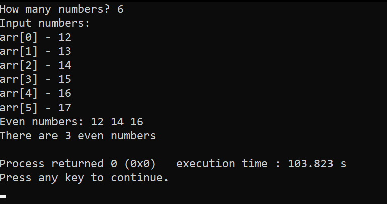

# Count Even Numbers (quickie)

Welcome to my simple program. It asks the user for numbers, prints the even ones, and shows how many even numbers were entered.  

## Screenshot



## What it does
- Asks the user how many numbers they want to input  
- Lets the user enter numbers manually  
- Prints all even numbers from the list  
- Counts how many even numbers there are  
- Displays the total count  

## How to run
1. Save the code into a file (e.g., `binabagabag.c`)  
2. Compile it:  
   ```bash
   gcc binabagabag.c -o binabagabag

---


